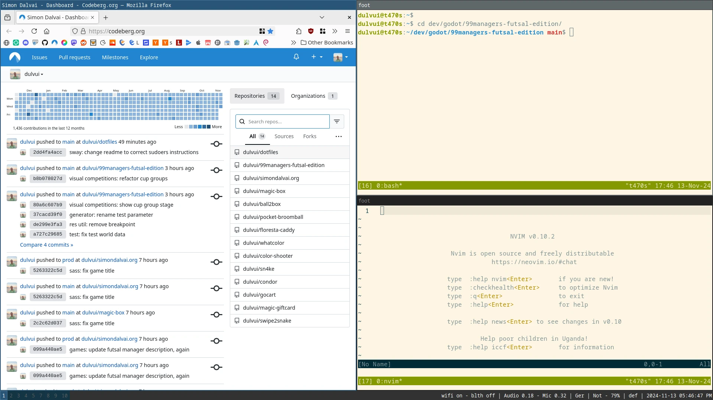
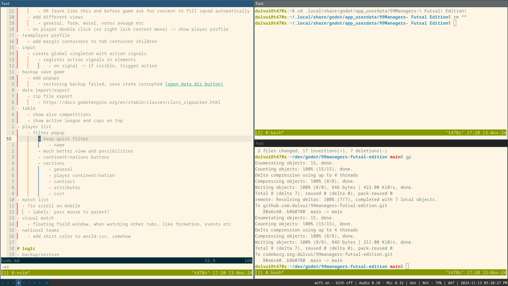
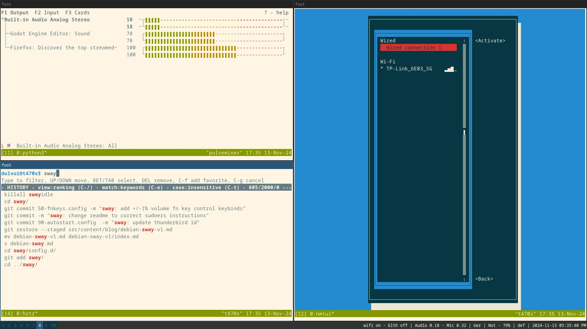

+++
title = "Debian Sway v1 - My first setup"
description = "This is ther version 1 of my Sway on Debain 12 setup with a list of useful tools."
date = 2024-11-16T10:00:00+00:00
updated = 2024-11-16T10:00:00+00:00
draft = true
[extra]
mastodon_link = ""
hackernews_link = ""
preview_image = "/blog/debian-sway-v1/debian-sway.webp"
+++

This year I started using [Sway](https://swaywm.org/) on my laptop running the latest stable [Debian 12](https://www.debian.org/).
Sway is a tiling window manager and a [i3wm](https://i3wm.org/) clone for Wayland.
As all tiling window managers, you can start, arrange and align windows directly **with the keyboard**.

  

I didn't find much on the web about how to setup and use Sway on Debian, therefore I will share my experience here.
Getting Sway running on Debian needs **time and patience**.
There is no official or unofficial Debian ISO image with Sway, and that means you need to setup everything from scratch.  

If you simply want to try Sway, without having to setup everything on your own, I would suggest [Fedora Sway](https://fedoraproject.org/spins/sway/).
It has a lot of tools already installed out of the box and is a great place to get a first impression.

As for every **highly configurable system**, no configuration is the same and everybody needs to **find what fits** best.
Keep in mind that this is no tutorial with exact and precise needed steps, but more a direction sign, showing you a possible path.

## XFCE, KDE and workspaces
As you might saw in my previous [blog post](@/blog/vscode-to-neovim.md), this year I also started using Neovim.
At that time, I was still using KDE Plasma 5 and I loved it.
I used a 3x3 workspace grid, I brought over from XFCE, and had specific programs always in the same workspace.

But being able to do everything with a few keystrokes, like in Neovim, just feels so nice.
Then I finally tried Sway, **side by side** to KDE Plasma and used both for some time.  
You can do that easily on Debian (and surely also on other distros), by simply installing Sway and then choosing it as desktop environment on the login screen.
Not everything was working 100%, but at least I got an idea if I like Sway or not.

## All or nothing
After a few weeks of using this hybrid system, I actually **uninstalled Sway** again and went back to KDE Plasma.
I simply couldn't get used to the Sway way of doing things and missed the ease of my old setup.

But in my opinion, with tools that need (a lot of) **time and muscle memory** to master, like Vim and Sway, you need to **go all in**.
If you simply can switch to your old editor or desktop environment, you will never learn it for real.
In difficult moments, you will simply switch to the other one, but exactly in that moments, you'll **learn the most**.

Then I finally did the hard switch and reinstalled Debian without any desktop environment and installed Sway on top of it.
Now I can't imagine using a "conventional" desktop environment again.  
Tiling window managers can give you a **feeling of connection** to your machine, that no mouse drag and click can replace.

## The good and the better
Now here I am, with a minimalistic Debian install and Sway, but nothing else.  
But, how can I connect to my WiFi?
Does Bluetooth work?
What did just happen?! Ohh, the battery is empty.  
This and other stories will happen, the **first time** you'll use such a bare bones setup.
In my previous try, all this things where covered by KDE, but Sway doesn't come with batteries included.
The Debian setup without desktop environment is **designed for servers**, and they don't have displays, batteries or Bluetooth.

This can be seen as bad, but in some way also as good, right?
You'll learn a lot of new tools and see **under the hood** of a conventional desktop environment.
All the heavy lifting a desktop environment does, is now on you.

I spent hours and hours trying to understand, which cli/GUI tool can cover my needs.
And now I have a nearly perfect setup and can do everything with the keyboard.
I couldn't imagine using something else.  
To note, that I exactly thought the same for XFCE then KDE ;-)

## The killer feature
But in my opinion the **real killer feature** of Sway is that it's reproducible.
Every tool and Sway itself, has it's own config file, that can be versioned and restored with git.
With that, you no longer have to remember what checkbox you clicked in the settings GUI.
If you reinstall your OS or change distro, you can simply **bring your config** files with you.

You can even **synchronize** everything automatically with other machines.
For example, you change your Sway key binds at home, and the next day at work, get the changes instantly synced to your working machine.
I currently use a git and [Syncthing](https://syncthing.net/) combination to backup and synchronize my most precious files.
Even on my Android phone with Neovim on Termux, I was able to reuse my Neovim configuration
(this was just an experiment, I'm not that crazy, yet...).
I guess, someday this synchronization setup will get it's own blog post.

## Tools
To save you some time, I tried to list all important tools I'm using.  
You can see my configuration of the following tools and my Debian install.sh script in my dotfiles repo on
[Codeberg](https://codeberg.org/dulvui/dotfiles)
or [Github](https://github.com/dulvui/dotfiles).

### Terminal
A fast, lightweight and minimalist Wayland terminal emulator aka **foot**.
```bash
apt install foot
```
You can even start it in server mode to save memory, not that it uses much, but still cool!
For me it was enough, being able to install a solarized-light theme easily.
When choosing the terminal, you should just make sure that your terminal emulator of choice **supports Wayland**.  

A good alternative is **Alacritty**.
But the version on Debian (at the time of writing) doesn't have yet the new toml configuration file.
Therefore, a lot of guides didn't work.

### Neovim
Well, you probably already use **Neovim** or another terminal based editor, if you feel the need to use Sway. 
Or maybe it will happen vice versa, using Sway will make you switch to one.
```bash
apt install neovim
```
This will install a quite "old" version of Neovim.
If you just want to use Neovim without much plugins, this version is fine for you.
But the **more plugins** you use, the **more compatibility issues** you'll face.
Read in my previous [blog post](@/blog/vscode-to-neovim.md#getting-the-latest-version-on-debian), on how to get the latest version to Debian 12.

Most famous ~enemy~ alternative is of course [GNU Emacs](https://www.gnu.org/software/emacs/) ;-)

  

Beautiful, beautiful Neovim with solarized-light theme (on the left).

### Terminal multiplexer
When you live in the terminal, having something like [tmux](https://github.com/tmux/tmux) is a great help.
```bash
apt install tmux
```
It brings multiple and detachable sessions, vertical and horizontal splitting, session recovery and much more.
I haven't figured it all out yet.

I use it daily and combined with Sway, it is really great.
In my setup, when opening a terminal, a tmux session will always start automatically.
Tmux is not essential and can be too much overhead, if you still need to learn and setup Sway.
My recommendation is, once you feel confident with Sway, try tmux.

An older and simpler alternative can be [screen](https://savannah.gnu.org/projects/screen).

### Network Manager
Remember clicking in your system tray and choose the WiFi in a nice looking UI?
This days are over and [Gnome's Network Manager](https://wiki.gnome.org/Projects/NetworkManager) will make it easy to never look back.
```bash
apt install network-manager
```

Once installed you can simply run **nmtui** and you'll see a terminal user interface with all needed networks settings.
In my opinion it looks quite cool, but if you don't agree, there surely exists another network manager with a nice GUI.

This is the only terminal network manager tool I found on Debian.
Other distros like Arch, have a lot of more options.

### Battery optimizations
The best tool I found in general for battery optimization, is [TLP](https://linrunner.de/tlp/).
It allows you also to limit the charging to 80%, for a increased total battery lifetime.
```bash
apt install tlp
# start it
tlp start
```
I used it also on other distros with various desktop environments and it always worked great.
I brings a lot of features like turning on bluetooth/wifi from cli.
For that, simply type **bluetooth on** and **wifi off**.
Or you can also disable them automatically on boot in the tlp config file.

A terrible battery experience I had, was the unexpected power off, when the **battery was empty**.
I highly prefer to suspend on 5% of battery, so I have time to find a charger.  
You achieve that, by creating a new udev rule under **/etc/udev/rules.d/99-lowbat.rules** with the following content.
```bash
# Suspend the system on 5% or lower
SUBSYSTEM=="power_supply", ATTR{status}=="Discharging", ATTR{capacity}=="[0-5]", RUN+="/usr/bin/systemctl suspend"
```
Now you are save, and your system will not self destroy itself unexpectedly.

### Sway bar
Sway comes with that tiny bar on the top or bottom, where you can see your workspaces, the time and any other info you need.  
Personally I use the built-in sway-bar, but many prefer and use the more feature packed [Waybar](https://github.com/Alexays/Waybar).
The Waybar can adjust volume, back light by **mouse scroll** or shutdown you machine with some mouse clicks.  
Another gem I found is [yambar](https://codeberg.org/dnkl/yambar) from the foot terminal author.
Looks great and is similar to Waybar.

I recommend **to try all** out and find what covers your needs best.

### Multiple monitors
[Kanshi](https://packages.debian.org/bookworm/kanshi) is a really useful tool, if you use a laptop that will connect to other monitors.
```bash
apt install kanshi
```
It allows you to define a monitor's position, resolution, orientation and much more.
So you can for example **disable the laptop's display** while attached to other monitors.
Or simply define which workspace is on which monitor.  

I still have some minor issues, that sometimes it doesn't really change workspace arrangement when docking my laptop.
Anyway, when reloading the Sway config with **Ctrl + c**, it's fixed 9 out of 10 times.
If not, I simply reload, until its fixed.
I suspect that there is some race condition, with another component of Sway.

### More tools...
Here some more tools I'm currently using. 
- [**thunar**](https://docs.xfce.org/xfce/thunar/start) - fast and lightweight file manager
- [**wofi**](https://hg.sr.ht/~scoopta/wofi) - application launcher and menu
- [**wlsunset**](https://sr.ht/~kennylevinsen/wlsunset/) - blue light filter
- [**mako**](https://github.com/emersion/mako) - lighweight notification daemon
- [**slurp**](https://github.com/emersion/slurp/releases) and [**grimshot**](https://packages.debian.org/bookworm/grimshot) - screenshots
- [**pulsemixer**](https://github.com/GeorgeFilipkin/pulsemixer) - cli audio control
- [**hstr**](https://github.com/dvorka/hstr) - see and search your full bash history with Ctrl + r
- [**xwayland**](https://packages.debian.org/bookworm/xwayland) - run X clients on Wayland
- [**light**](https://packages.debian.org/bookworm/light) - adjust display brightness

And here the last screenshot, running **hstr** (bottom left), **pulsemixer** (top left) and **nmtui** (right).

  

## Fine tuning
I did some other minor changes to fit my needs and habits.
I tried and changed a lot of stuff, but I hope I covered everything in my dotfiles repo and here in this blog post.

### Grant some permissions
I like having my user **not in the sudoers group**, like Debian has per default.
Because of that, I can't simply run **sudo command** but have to use the root user.  
I really like this approach, since I know when I use root, to **be cautious**.
And secondly, no shady script (or more probably myself) can run **dangerous** sudo commands with my user.  
The only drawback is that some programs like **light** or **systemctl** need root access.
So I granted root access to my user for that programs, by running the following 2 lines, as root user.
```bash
echo "# for light and systemctl shutdown, suspend, reboot" >> /etc/sudoers
echo "%dulvui ALL=(root) NOPASSWD: /usr/bin/light,/usr/bin/systemctl" >> /etc/sudoers
```

Now I can change my laptops display brightness.
```bash
# more bright
light -A 5
# less bright
light -U 5
```

And use systemctl for even more trivial things, without sudo.
```bash
systemctl poweroff
systemctl suspend
systemctl reboot
```

### Power button instant shutdown
Per default, your machine will power off instantly, when you press the power button.
This can get annoying, when you **intend to wake up** your machine from suspension, and instead **turn it off**.  

Thanks to this [reddit post](https://www.reddit.com/r/swaywm/comments/180ly44/how_to_change_power_button_behavior/),
I found the solution.
```bash
# as root
vim /etc/systemd/logind.conf

# change following values
HandlePowerKey=ignore
HandlePowerKeyLongPress=poweroff

# restart logind or reboot
systemctl restart systemd-logind
```
The long press power button (emergency) shutdown still works, because **HandlePowerKeyLongPress** is set to poweroff.

### Bluetooth audio
Getting my wireless headphones to **connect** and play **good quality sound**, was maybe the most difficult problem I solved, somehow...  
First, I was able to connect them, but the quality was really bad (using Hands Free protocol).
Now it is working fine, but for this I changed so much, that I can't really tell, what worked in the end.  
I will try my best and list what I have installed, to fix the issue (out of frustration).
```bash
# audio
apt install pipewire
apt install wireplumber
apt install pipewire-alsa
apt install pipewire-audio 
apt install pipewire-audio-client-libraries
apt install pipewire-bin
apt install pipewire-jack
apt install pipewire-pulse
# bluetooth
apt install bluez
# gui for pairing
apt install blueman
# for a2dp and other bluetooth profiles
apt install libspa-0.2-bluetooth
```

Once I install my OS again, I will be able to test what actually fixed the issue.
Then I will update also this blog post.
Until then, if you tested it or simply know it better, **please contact me**.

Note: I own Sony headphones and I need to mention this, since it seems that many companies have their **own Bluetooth profile**.
For that reason, it could be that yours work out of the box or need another library to work.

### Start Sway on login
Simply put the following lines to your **~/.profile** file, and Sway will launch automatically, once you logged in.
This will also set some Wayland flags for Firefox, Thunderbird and other applications.  
```bash
# Sway autostart
if [ -z "$WAYLAND_DISPLAY" ] && [ "$XDG_VTNR" -eq 1 ]; then
    export MOZ_ENABLE_WAYLAND=1
    export XDG_SESSION_TYPE=wayland
    export XDG_CURRENT_DESKTOP=sway
    exec sway
fi
```
I tried some login screens with nice GUIs, but at the end I use the default "login:" white text on black background.
Simple yet effective and once I got used to it, I didn't mind that it doesn't look fancy.

### Screen sharing
This was the main reason, I still kept KDE on my system, since it **didn't work** out of the box with Sway.
But then I decided to bite the bullet and finally fixed, it thanks to this guide on [Reddit](https://www.reddit.com/r/swaywm/comments/l4e55v/guide_how_to_screenshare_from_chromiumfirefox/).
This was the final hurdle I had to pass, before switching fully to Sway.  
To get it working, simply install the following programs.
```bash
apt install xdg-desktop-portal
apt install xdg-desktop-portal-wlr
```
Append the following lines to your Sway config file, or somewhere that will execute them, after Wayland has started.
```bash
exec /usr/libexec/xdg-desktop-portal -r
exec /usr/libexec/xdg-desktop-portal-wlr
```
And make sure the flag **MOZ_ENABLE_WAYLAND=1** from the previous section is set.

## Future improvements aka v2
As you can imagine, after reading the title of this blog post, there will be a v2.

I could imagine **replacing my bash scripts**, with something more mature and reliable as [Ansible](https://www.ansible.com/).
This would make the setup reproducible for everyone and more portable, maybe even for other distros.
If I switch to Ansible, I'll let you know for sure, in another blog post.  
Then I will discover more cool tools, or even **switch to Arch**?
Or simply upgrade to Debian 13 Trixie and save some years of life, and gray hair.

Last but not least, v3 will be my own Debian distribution with Sway, maybe **Swaybian**?
Or I could become the maintainer of an official Debian Sway release.
Never stop dreaming :-)

## Useful links
To conclude my **longest blog post so far**, a collection of links and wikis I found useful on my journey.
- Sway page on [ArchWiki](https://wiki.archlinux.org/title/Sway)
- Sway page on [Gentoo Wiki](https://wiki.gentoo.org/wiki/Sway)
- Sway page on [Debian Wiki](https://wiki.debian.org/sway)
- Fedora Sway [config repo](https://gitlab.com/fedora/sigs/sway/sway-config-fedora)
- Bluetooth page on [Debian wiki](https://wiki.debian.org/BluetoothUser)

Note: The ArchWiki was especially helpful in general.
You can find a lot of great cli tools and information, about how to run a minimalist OS.

