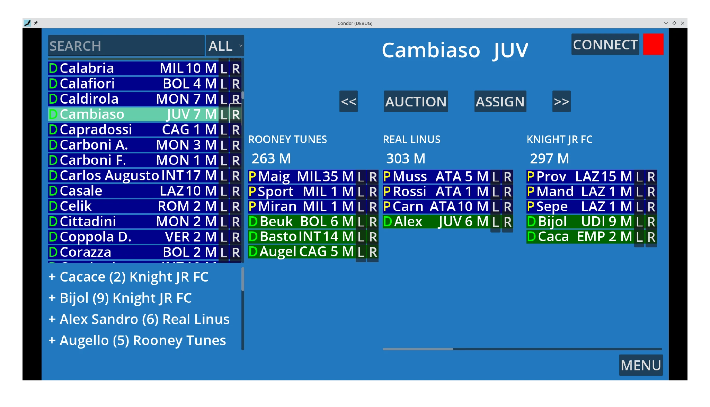

+++
title = "Create non-game apps with Godot Engine"
description = "My personal experience on how I use Godot Engine to create non-game applications"
date = 2023-09-18T00:00:00+00:00
updated = 2023-09-18T00:00:00+00:00
[extra]
mastodon_link = "https://mastodon.social/@dulvui/111087833333535854"
+++

The main target of the Godot Engine are game developers.
But Godot's easy workflow and functional UI elements, makes it also a good fit for non-game applications.
There are already some out there you may know, like [Pixelorama](https://github.com/Orama-Interactive/Pixelorama), an Open Source 2D sprite editor.

## A Condor is born
Recently I also started creating an application made with Godot Engine, named "Condor".
It is a mobile and desktop app for managing the Italian Fantasy Football "Fantacalcio" auction.
If you never heard of "Fantacalcio" or "Fantasy Football", it is a game where you compete with a group of friends, by buying real football players and earning points in each match day, depending on the real life performance of the football players.
You can read more about it on [Wikipedia](https://en.wikipedia.org/wiki/Fantasy_football_(association)).

The name "Condor" derives from the nickname "il condor" of [Adriano Galliani](https://en.wikipedia.org/wiki/Adriano_Galliani).
He gained the name by his strategy of buying football players during the last hours of the transfer market, to get better conditions, because teams want to get rid of some players they where not able to sell yet.
Since this application also brings a timer for the auction, it gets more intense and interesting until the last moments.
So, some might buy a player during the last seconds of the auction and become a condor too. 

There are already some auction apps out there, but none of them (at least as I found) is Open Source and available for Linux, without ads and tracking.
You can find the source code on [Github](https://github.com/dulvui/condor) or [Codeberg](https://codeberg.org/dulvui/condor) as usual.

## First impressions
For now I really enjoy creating apps with the Godot Engine, since it is really easy and fast to create complex UIs.
It is perfect for fast prototyping and Godot's Scene/Node architecture with signals, makes it quite easy to understand.
Since the whole Engine is Open Source, you can find a lot of code and sample project out there.
I don't have much experience with other cross-platform development kits like [Flutter](https://flutter.dev/).  
If someone has experience with Flutter and Godot, please let me know, if Flutter or any other cross-platform development kit would be a better fit or not.

## WebSockets and Hetzner Cloud
One goal of the application is also to make it possible to follow the auction remotely.
So, all participants can see all the football players someone bought during the auction, the remaining budget, still available players and participate at the auction with the auction timer.

To implement this features, I used a simple WebSocket client/server architecture and the cheapest Hetzner cloud server for around 4€ per month.
I used Godot's official WebSocket chat demo project you can find on [Github](https://github.com/godotengine/godot-demo-projects/tree/master/networking/websocket_chat).
Running the server for 3 days costs me around 0,30€.
Of course this setup is just for personal use and would (probably) not work for many players.

## Testing in real auction
I used the application in one real life auction and it nearly worked perfectly.
Except some synchronization issues with the remote players, since there is no resync implemented yet, if the connection fails.
So, someone misses all the players that are sold, during the disconnection.

  

Here you can see the admin view in action (I'm not a designer).  
On the left top, you can see all players list and the sell/buy history is visible in the left bottom corner.
On the right from top to down: the active player with the auction controls and then the overview of all teams.

## Next steps
Since WebSockets require a constant connection with a server or a host, WebRTC might be a better fit for this scenario.
With WebRTC you still need a server, but only to match the peers together.
Once they are connected, the communication is directly peer2peer.

Then the UI needs of course a huge redesign and more appealing and modern graphical elements.

## Release date
This year I will use the app only internally for my own Fantacalcio league, but I plan to release it to the public for the next season 2024/2025.
So, the application will be released for mobile, desktop and web during summer 2024 (hopefully).

## Final verdict
I really enjoyed creating this application, since I learned a lot, especially on how to create stable und working UIs in Godot.
It was also my first online multiplayer experience with Godot.
So, if you already know how to use the Godot Engine or want to learn it, even for non-game applications, give it a try.
