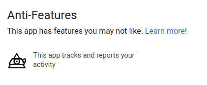

+++
title = "How to publish Godot 3 to F-Droid"
description = "How to build and publish an Open Source Godot Engine 3.x game to F-Droid"
date = 2023-04-22
updated = 2023-04-22
aliases = ["gfd"]
[extra]
mastodon_link = "https://mastodon.social/@dulvui/110241242233980633"
hackernews_link = "https://news.ycombinator.com/item?id=36466696"
+++

[F-Droid](https://f-droid.org) is an awesome app that gives you access to thousands of Free and Open Source Software apps and games. 
It also respects your privacy, requires no login and lets you know if an app has anti-features like tracking, ads, proprietary assets or if it depends on the proprietary Google Play Services.
If an app has ads or tracks you, it is marked as [AntiFeatures](https://f-droid.org/docs/Anti-Features).  
  
I was able to publish [Ball2Box](@/games/ball2box/index.md) to F-Droid and here I will share the steps that are needed to do so.  
[Here](https://f-droid.org/en/packages/com.simondalvai.ball2box/) you can find the published game.


## Requirements
To publish a [Godot Engine](https://godotengine.org) game to F-Droid you'll need an Open Source game with the source code published on a **public git repository**.
You also need a Gitlab account to create a merge request to the F-Droid Data [repository](https://gitlab.com/fdroid/fdroiddata) or you can make an Application Proposal where others include your app.  
In the [documentation](https://f-droid.org/docs/Inclusion_How-To/) you can read how the inclusion works.
You also need a metadata [directory](https://github.com/dulvui/ball2box/tree/main/metadata) in your repo with some screenshots, a description and the changelogs of your game.  
F-Droid builds its apps itself and **all its dependencies** completely from the source.
That means that you need also to build the Godot Engine from its source code.  
If you have other **third party dependencies** you have also to build them from the source code.
My game doesn't have any other dependency than the Godot Engine, so if your game has some, you will have to extend the following build recipe with the steps to build your dependencies.  
All the steps needed are written in a yaml build recipe file.
The best is to follow the official F-Droid Developer [documentation](https://f-droid.org/en/docs/) so you will follow always the latest and correct steps.

## The Godot build recipe
Here the Godot build recipe.
You can find the always up to date version on [Gitlab](https://gitlab.com/fdroid/fdroiddata/-/blob/master/metadata/com.simondalvai.ball2box.yml)  
You'll also need a **metadata** directory and a **exports_preset.cfg** in the repo of you game.
You can find mine on [Github](https://github.com/dulvui/ball2box) in the fdroid and metadata directories.

```yml
Categories:
  - Games
License: AGPL-3.0-or-later
AuthorName: Simon Dalvai
AuthorEmail: info@simondalvai.com
AuthorWebSite: https://simondalvai.com
WebSite: https://simondalvai.com/games/ball2box/
SourceCode: https://github.com/dulvui/ball2box/
IssueTracker: https://github.com/dulvui/ball2box/issues
Donate: https://simondalvai.com/donate

Name: Ball2Box
AutoName: Ball2Box

RepoType: git
Repo: https://github.com/dulvui/ball2box.git

Builds:
  - versionName: 2.2.6
    versionCode: 44
    commit: a9ec9a5f025542c27196a0f5b3507a652e05e907
    sudo:
      - apt-get update
      - apt-get install -y clang gettext pkg-config scons
    output: game/Ball2Box.apk
    srclibs:
      - Godot@6fed1ffa313c6760fa88b368ae580378daaef0f0
    prebuild:
      - mv fdroid/export_presets.cfg game/export_presets.cfg
      - sed -i 's/FDROID = false/FDROID = true/g' game/src/globals/Global.gd
    build:
      - export HOME=$PWD
      - cp -R $$Godot$$ godot
      - keytool -genkey -v -keystore debug.keystore -storepass android -alias androiddebugkey
        -keypass android -dname "CN=Android Debug,O=Android,C=US"
      - mkdir -p ./.config/godot/
      - export SDK_PATH="export/android/android_sdk_path = \"$$SDK$$\""
      - export DEBUG_KEYSTORE_PATH="export/android/debug_keystore = \"$PWD/debug.keystore\""
      - echo '[gd_resource type="EditorSettings" format=2]' >> ./.config/godot/editor_settings-3.tres
      - echo "[resource]"  >> ./.config/godot/editor_settings-3.tres
      - echo $SDK_PATH >> ./.config/godot/editor_settings-3.tres
      - echo $DEBUG_KEYSTORE_PATH >> ./.config/godot/editor_settings-3.tres
      - echo 'export/android/debug_keystore_user = "androiddebugkey"' >> ./.config/godot/editor_settings-3.tres
      - echo 'export/android/debug_keystore_pass = "android"' >> ./.config/godot/editor_settings-3.tres
      - cd godot
      - scons -j `nproc` platform=server use_llvm=yes unix_global_settings_path=".."
        profile=fdroid/godot-build-options.py
      - export ANDROID_NDK_ROOT=$$NDK$$
      - scons -j `nproc` use_llvm=yes p=android target=release  unix_global_settings_path=".."
        android_arch=armv7 profile=fdroid/godot-build-options.py
      - scons -j `nproc` use_llvm=yes p=android target=release  unix_global_settings_path=".."
        android_arch=arm64v8 profile=fdroid/godot-build-options.py
      - pushd platform/android/java/
      - gradle generateGodotTemplates
      - popd
      - cd ..
      - mkdir -p ./.local/share/godot/templates/3.5.1.stable/
      - echo "3.5.1.stable" >> ./.local/share/godot/templates/3.5.1.stable/version.txt
      - cp godot/bin/android_release.apk ./.local/share/godot/templates/3.5.1.stable/
      - ./godot/bin/godot_server.* -v --path game --export Android Ball2Box.apk
      - find . -iname "*.apk"
      - echo "build end"
    ndk: r23c

AutoUpdateMode: Version
UpdateCheckMode: Tags
UpdateCheckData: fdroid/export_presets.cfg|version/code=(\d+)|.|version/name="([\d.]+)"
CurrentVersion: 2.2.6
CurrentVersionCode: 44
```


