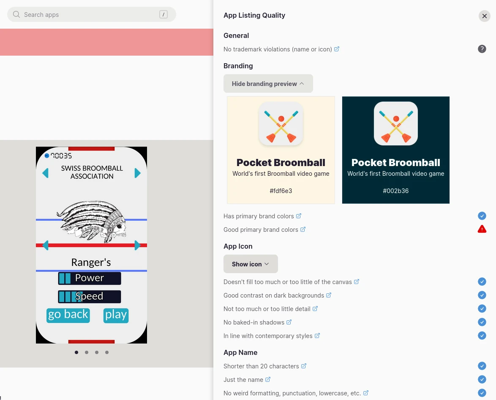

+++
title = "How to publish Godot games on Flathub, in a nutshell"
description = "How to build and publish an Godot Engine 3.5 game on Flathub, in a nutshell"
date = 2024-03-26T21:25:00+00:00
updated = 2024-03-26T21:25:00+00:00
[extra]
mastodon_link = "https://mastodon.social/@dulvui/112164102888378393"
+++

[Flathub](https://flathub.org/) is an Open Source and community driven App Store for any GNU/Linux system.
Recently I published my two Godot games [Ball2Box](https://flathub.org/apps/org.simondalvai.ball2box) and [Pocket Broomball](https://flathub.org/apps/org.simondalvai.pocket-broomball) on Flathub.  
Both use Godot Engine 3.5 base image, so this post will focus on version 3.5, but you can check for other Godot versions [in the BaseApp](https://github.com/flathub/org.godotengine.godot.BaseApp).  

## Flathub submission
You should always read the official submission docs of Flathub, to know the latest and correct [steps](https://docs.flathub.org/docs/for-app-authors/submission/).

In a nutshell, the process is the following  
1) Fork Flathub repo
2) Create files
   1) manifest
   2) appdata.xml
   3) desktop file
   4) 256x256 icon
3) Open pull request

## Manifest file
The main file of a Flatpak app is the manifest file, containing all **information needed to build the app**.  

```yml
app-id: org.simondalvai.ball2box
runtime: org.freedesktop.Platform
runtime-version: '23.08'
sdk: org.freedesktop.Sdk
base: org.godotengine.godot.BaseApp
# Godot version
base-version: '3.5-23.08'
command: godot-runner
finish-args:
  - --share=ipc
  - --socket=x11 # <-- Godot needs X11
  - --socket=pulseaudio
  - --device=dri
modules:
  - name: Ball2Box
    buildsystem: simple
    build-commands:
      # The game itself
      - install Ball2Box.pck /app/bin/godot-runner.pck
      # Metadata and a .desktop file
      - install -D org.simondalvai.ball2box.desktop /app/share/applications/org.simondalvai.ball2box.desktop
      - install -D org.simondalvai.ball2box.appdata.xml /app/share/metainfo/org.simondalvai.ball2box.metainfo.xml
      # Icons
      - install -D icon-256.png /app/share/icons/hicolor/256x256/apps/org.simondalvai.ball2box.png
    sources:
      # The game is pulled from GitHub
      - type: archive
        strip-components: 0
        url: https://github.com/dulvui/ball2box/releases/download/v4.1.0/ball2box.tar.xz
        sha256: 971b4a47bda0aa3f0bc6e1766b61eb848d0e10156505fef1f66531ac375bd5d4
      - type: file
        url: https://raw.githubusercontent.com/dulvui/ball2box/350a39a4eabc989145d22fbe0be0b4ae69033c71/flatpak/org.simondalvai.ball2box.desktop
        sha256: 6a6d1d14649730dc3c61ce8c62baed9d2b8f2c71c801b1a8420275361bdff2e1
      - type: file
        url: https://raw.githubusercontent.com/dulvui/ball2box/350a39a4eabc989145d22fbe0be0b4ae69033c71/flatpak/org.simondalvai.ball2box.appdata.xml
        sha256: c4aa1c9d9f3091c0be44269f591589bf5fc181c172a06f6882981345331f9552
      - type: file
        path: icon-256.png
```

Here the links to the Github repositories, where you can find the manifests  
[**Ball2Box**](https://github.com/flathub/org.simondalvai.ball2box)  
[**Pocket Broomball**](https://github.com/flathub/org.simondalvai.pocket-broomball)  

## Appdata.xml
The appdata file contains all other information of your app, like **license, descriptions and screenshots**.
This file should be **upstream** and placed in the repository of your app, if possible.

```xml
<?xml version="1.0" encoding="UTF-8"?>
<component type="desktop-application">
  <id>org.simondalvai.ball2box</id>
  <name>Ball2Box</name>
  <developer_name>Simon Dalvai</developer_name>
  <launchable type="desktop-id">org.simondalvai.ball2box.desktop</launchable>
  <project_license>AGPL-3.0-or-later</project_license>
  <metadata_license>CC0-1.0</metadata_license>
  <summary>Shoot the ball into the red box</summary>
  <url type="homepage">https://simondalvai.org/games/ball2box</url>
  <url type="bugtracker">https://github.com/dulvui/ball2box/issues</url>
  <url type="donation">https://simondalvai.org/donate</url>
  <url type="vcs-browser">https://github.com/dulvui/ball2box</url>
  <description>
    <p>Can you get all three stars on all levels?
    </p>
    <ul>
      <li>120+ levels and more coming soon...</li>
      <li>20+ different styled balls to collect</li>
      <li>Privacy friendly</li>
      <li>Offline game</li>
      <li>Created with Godot Engine 3</li>
    </ul>
  </description>
  <branding>
    <color type="primary" scheme_preference="light">#fdf6e3</color>
    <color type="primary" scheme_preference="dark">#002b36</color>
  </branding>
  <screenshots>
    <screenshot type="default">
      <image>
        https://raw.githubusercontent.com/dulvui/ball2box/570f236ac3d220d40e313e99859424d324386738/metadata/en-US/images/phoneScreenshots/Android-1.png
      </image>
    </screenshot>
    <screenshot>
      <image>
        https://raw.githubusercontent.com/dulvui/ball2box/570f236ac3d220d40e313e99859424d324386738/metadata/en-US/images/phoneScreenshots/Android-2.png
      </image>
    </screenshot>
    <screenshot>
      <image>
        https://raw.githubusercontent.com/dulvui/ball2box/570f236ac3d220d40e313e99859424d324386738/metadata/en-US/images/phoneScreenshots/Android-3.png
      </image>
    </screenshot>
    <screenshot>
      <image>
        https://raw.githubusercontent.com/dulvui/ball2box/570f236ac3d220d40e313e99859424d324386738/metadata/en-US/images/phoneScreenshots/Android-4.png
      </image>
    </screenshot>
  </screenshots>
  <content_rating type="oars-1.1" />
  <releases>
    <release version="4.1.0" date="2024-02-15">
      <description>
        <ul>
          <li>levels functionality</li>
          <li>user interface refactoring</li>
        </ul>
      </description>
      <url>https://github.com/dulvui/ball2box/releases/tag/v4.1.0</url>
    </release>
  </releases>
</component>
```

Here the links to the appdata files  
[**Ball2Box**](https://github.com/dulvui/ball2box/blob/main/flatpak/org.simondalvai.ball2box.appdata.xml)  
[**Pocket Broomball**](https://github.com/dulvui/pocket-broomball/blob/main/flatpak/org.simondalvai.pocket-broomball.appdata.xml) 

## Desktop file
The desktop file finally defines how the app will appear in the OS, once installed.
Also this file should be **upstream** and placed in the repository of your app, if possible.

```bash
#!/usr/bin/env xdg-open
[Desktop Entry]
Name=Ball2Box
GenericName=Ball2Box
Comment=Shoot the ball into the red box!
Exec=godot-runner
Icon=org.simondalvai.ball2box
Type=Application
Categories=Game
```

Here the links to the desktop files  
[**Ball2Box**](https://github.com/dulvui/ball2box/blob/main/flatpak/org.simondalvai.ball2box.desktop)  
[**Pocket Broomball**](https://github.com/dulvui/pocket-broomball/blob/main/flatpak/org.simondalvai.pocket-broomball.desktop)

### 256x256 px icon
Finally, you'll need an icon for the app, that should also be upstream.
It took me some time until I had the correct size of the icons with **the right padding**.
So, make sure that the icon follows the [quality guidelines](https://docs.flathub.org/docs/for-app-authors/metainfo-guidelines/quality-guidelines/#icon-size).

Here the links to the icons  
[**Ball2Box**](https://github.com/flathub/org.simondalvai.ball2box/blob/master/icon-256.png)  
[**Pocket Broomball**](https://github.com/dulvui/pocket-broomball/blob/main/flatpak/icon-256.png)  

Note: The Ball2Box icon is placed in the Flathub repo, since I was not told in my PR to move it upstream.
But it is still recommended to have it upstream, like it is in Pocket Broomball. 

## After submission
Once your pull request gets closed and the app is available on Flathub, you can [login](https://flathub.org/login) to Flathub and access some settings like **app verification** and the **app listing quality**.

### App verification
To verify that you are the owner of the app, you can add a verification token to a .well-known/org.flathub.VerifiedApps.txt file accessible on your website.
The **domain must match the app-id** used in the Manifest, like **org.simondalvai.ball2box** in my case.  
[simondalvai.org/.well-known/org.flathub.VerifiedApps.txt](https://simondalvai.org/.well-known/org.flathub.VerifiedApps.txt)

If you have multiple apps, you can simply add multiple verification tokens to the file.

### App Listing Quality
Flathub gives you also access to the app listing quality check.
To see that, you simply open the site of your game, while logged in.
Flathub has several [quality guidelines](https://docs.flathub.org/docs/for-app-authors/metainfo-guidelines/quality-guidelines) you have to follow.
If something is wrong, you can fix the issues and request a review.
Soon you'll see if the problems have been resolved.

Here an example of the app listing quality check for [Pocket Broomball](https://flathub.org/apps/org.simondalvai.pocket-broomball)  

  


## Final verdict
Once an app is published and you are familiar with the processes, it is **really easy** to publish another one.
I also got quite some downloads (at least for me).
Currently both have **250+ downloads** combined.
If I compare this numbers with App Stores like Google Play and Apple App Store, they are quite impressive!  

And of course: **more app stores, more visibility**.

If you want to see more details of the pull requests itself, here the links  
[**Ball2Box**](https://github.com/flathub/flathub/pull/4956)  
[**Pocket Broomball**](https://github.com/flathub/flathub/pull/5062)
