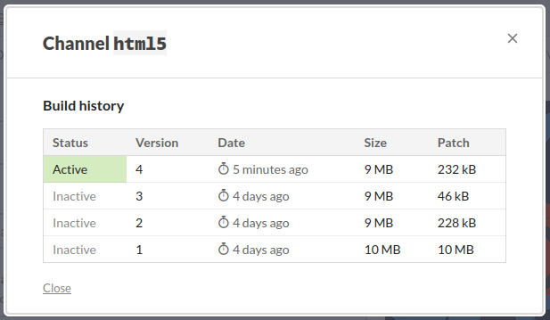
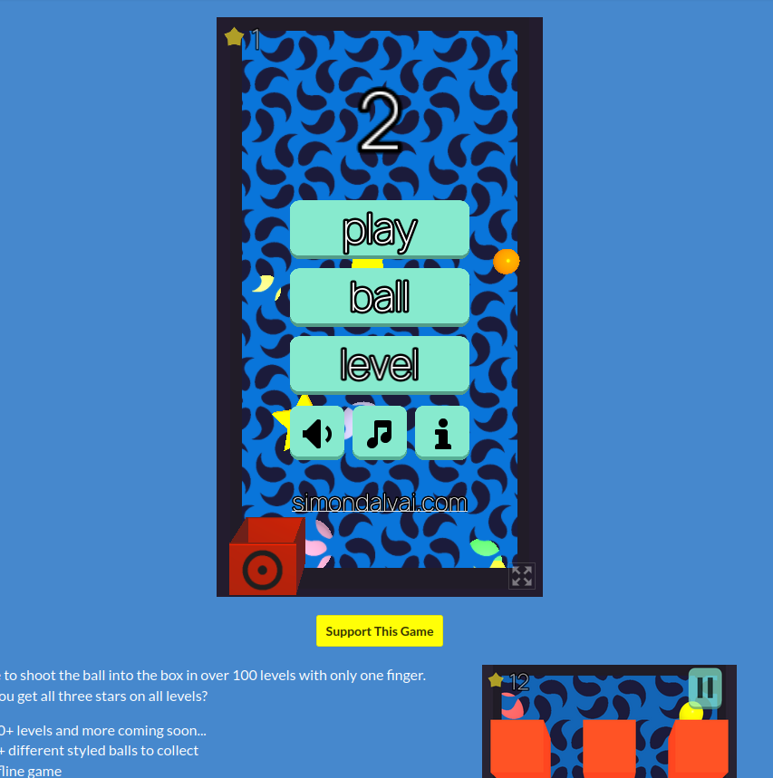

+++
title = "Upload a Godot HTML5 game to itch.io with Github Actions"
description = "Automatically upload your Android Godot game to itch.io with Github Actions godot-html-export and itchio-butler-upload"
date = 2023-06-07
updated = 2023-06-07
[extra]
mastodon_link = "https://mastodon.social/@dulvui/110504878897747399"
hackernews_link = "https://news.ycombinator.com/item?id=36466696"
+++

With the following two Github Actions you can export a Godot game to HTML and upload it to [itch.io](https://itch.io)
- [godot-html-export](https://github.com/dulvui/godot-html-export)
- [itchio-butler-upload](https://github.com/dulvui/itchio-butler-upload)

First you need to create a game on itch.io with all the needed information,
then a first build can be uploaded with this Github Action.  
With this simple action you can automate the upload on every push.
Of course the branch, game names etc. must be changed according to your needs.
Read the **comments** in the following action code to understand whats happening.
```yml
name: itch.io upload

# define what triggers the action
# in this case: on push if one of the files named in paths changes
on:
  push:
    paths:
      - "version-android"
      - "version-ios"
      - ".github/workflows/upload-itchio.yml"

# the directory where your game is
# I always put the game inside a 'game' folder
env:
  WORKING_DIRECTORY: game

jobs:
  deploy:
    # only run action, if pushed on prod branch
    # change or remove according to your needs
    if: github.ref == 'refs/heads/prod'
    runs-on: ubuntu-20.04
    steps:
      - name: Checkout source code
        uses: actions/checkout@v3
    
      # change or remove according to your needs
      - name: Delete iOS icons
        run: rm -rf $WORKING_DIRECTORY/AppIcons
      
      # change or remove according to your needs
      - name: Create export directory
        run: mkdir html5

      # exports the game in html mode
      # more info here https://github.com/dulvui/godot-html-export
      - name: Godot HTML5 export
        uses: dulvui/godot-html-export@v0.0.2
        with:
          working-directory: $WORKING_DIRECTORY

      # uploads to itch.io
      # more info here https://github.com/dulvui/itchio-butler-upload
      - name: Upload to itch.io
        uses: dulvui/itchio-butler-upload@v0.0.1
        with:
          working-directory: html5
          api-key: ${{ secrets.ITCHIO_API_KEY }}
          user: simondalvai
          game: ball2box
          channel: html5
```

When the upload is finished, after a few seconds, you can already play the game in your browser. 
Here you can see the uploaded games in the Channel history.
  


And here the final result: Ball2Box playable in you browser on itch.io
  


You can find working examples in my games [Pocket Broomball](https://github.com/dulvui/pocket-broomball/blob/main/.github/workflows/upload-itchio.yml) and [Ball2Box](https://github.com/dulvui/ball2box/blob/main/.github/workflows/upload-itchio.yml).

The single actions can also be used for other platforms or exports.
For example the html export can be uploaded to your website or another HTML games portal.
So can also the itch.io action be used to upload other games formats than HTML5 to itch.io like Android, iOS or Desktop.

