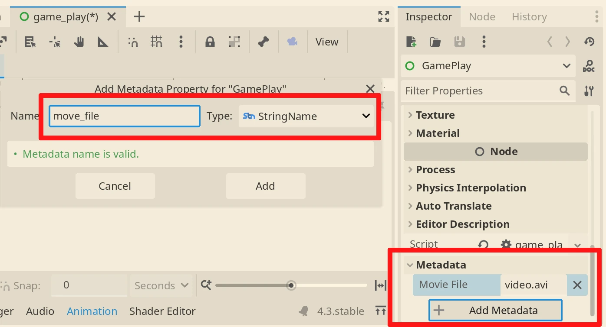
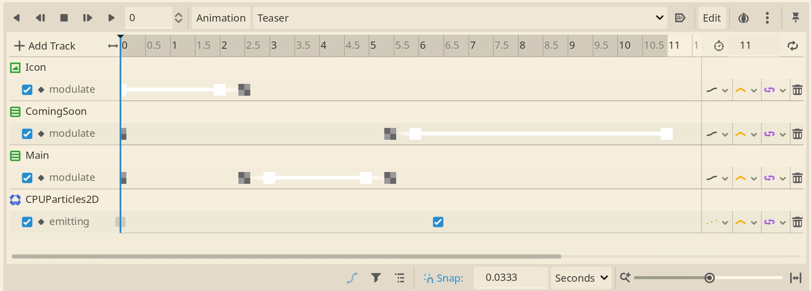

+++
title = "Creating a trailer for Steam  with Godot Movie Maker"
description = "How I created the Steam gameplay trailer for my upcoming game 99 Managers Futsal Edition with Godot Movie Maker"
date = 2024-12-15T10:15:00+00:00
updated = 2024-12-15T10:15:00+00:00
draft = false
[extra]
mastodon_link = ""
hackernews_link = ""
preview_image = ""
+++

To release a game on Steam, a video of the game is needed.
It doesn't really need to be a video about actual game play, but can only be a teaser, where you announce your game.  
Note: As later turned out, at least **one video must contain gameplay** scenes.

I don't have much experience with video creation and editing, so I started to **search the web** once again for Open Source video editing tools.
The first I found where [OpenShot](https://www.openshot.org/) or [Kdenlive](https://kdenlive.org), which I already used and where quite happy with them.
But I used them mostly simply to edit existing videos, not to create new content from scratch.  
Since they are quite resource intensive and a bit complicated if not used regularly, I mostly nowadays prefer [FFmpeg](https://www.ffmpeg.org/) for this.
FFmpeg is fast, can be used in **command line** and I can save the command in some file to automate or at least to remember it.  
But none of the above truly fulfilled my need.

## Godot Movie Maker to the rescue!
After some time,I remembered that Godot actually has a feature called **Movie Maker**.
And the best part is:  
I know how to use Godot **+** it can make movies **=** perfect match!

Godot's Movie Maker feature allows you to create Movies with everything Godot is capable of.
So you can code a movie using **Tweens**, the **AnimationPlayer**, pure **code** or whatever comes to your mind.  
The best part, everything is **automated** and supports versioning with **git**.
So for example it's possible to **translate** the video in different languages with ease.
Or if you made a mistake and broke something, simply run **git restore** and your work is save.


And here the **magic button**, on the most right, that transforms Godot into Hollywood.
Just press it and everything you will see on the screen will be saved to the file.
The file needs to be defined in Project Settings under **Editor>Movie Writer>Movie File**.
Or add the String **move_file** to the scene's **metadata** as I did in the screenshot below.



If you plan to only make one video with your project, use the project settings.
Otherwise the metadata is more convenient, because you can have multiple files defined in different scenes.

## The first result
This is the final result of my teaser. Oscars, I'm coming!  
You can find it on [YouTube](https://www.youtube.com/watch?v=ToVRZsfPimE)
or if you prefer, **more privacy friendly** on [Mastodon](https://mastodon.social/@dulvui/113628533674230281).

It's quite simple with no special effects, except the ball fireworks at the end.
But I was quite fast to create it, can iterate it like I do with code and really love the idea of using Godot.

```gd
extends Control

@onready var animation_player: AnimationPlayer = %AnimationPlayer


func _ready() -> void:
	theme = ThemeUtil.get_active_theme()
	animation_player.play("Teaser")
```
As you an see, the code here is quite simple, since everything is done in the **AnimationPlayer**.



The AnimationPlayer simply defines how Node properties transform over time.
For the first attempt this was totally fine, but it needs a **lot of clicking, sliding and patience**.
I highly prefer to code everything and use less the mouse.

You can find the full source code
on [Codeberg](https://codeberg.org/dulvui/99managers-futsal-edition/src/branch/main/game/src/media)
or [Github](https://github.com/dulvui/99managers-futsal-edition/tree/main/game/src/media).  
Note: The location of the trailer files might change in the future, so this links might break.
Let me know if that happens, so I can fix it.

## Let's add some gameplay
I quickly got the reply from the Steam review team about my teaser.
The teaser is fine, but as mentioned before, at least on video needs gameplay scenes of the actual build you try to release.

So I made another iteration of my teaser code.
Having the complete game available while making the video is a big advantage.
This means I will be able to integrate game play scenes easily (at least I hope so).

This time I used only GDScript and Tweens to make the video.
I prefer this much more, since now I can reuse this code to create another video very quickly.
```gd
extends Control

@onready var icon: TextureRect = %Icon

@onready var teaser: VBoxContainer = %Teaser
@onready var teaser_title: Label = %Title
@onready var teaser_text: Label = %Text


func _ready() -> void:
	theme = ThemeUtil.get_active_theme()
	Tests.setup_mock_world(true)
	
	# search next match day, to have real team and player names
	Tests.find_next_matchday()

	# setup scenes
	var match_scene: PackedScene = load(Const.SCREEN_MATCH)
	var match_screen: MatchScreen = match_scene.instantiate()
	add_child(match_screen)
	var dashboard_scene: PackedScene = load(Const.SCREEN_DASHBOARD)
	var dashboard_screen: Dashboard = dashboard_scene.instantiate()
	add_child(dashboard_screen)


	# set initial modulates
	icon.modulate = Color.WHITE
	match_screen.modulate = Color.TRANSPARENT
	teaser.modulate = Color.TRANSPARENT
	dashboard_screen.modulate = Color.TRANSPARENT

	# icon
	await wait(2)
	await fade_out(icon)
	
	await show_teaser(3, "The world's first\nFutsal Manager game")

	# match teaser
	await show_teaser(2, "With 2D Match Engine")
	
	# match
	await show_screen(6, match_screen)

	# dashboard teaser
	await show_teaser(1, "Have full control")
	# dashboard
	await show_screen(3, dashboard_screen)
	# show formation
	await show_teaser(1, "Choose tactics")
	dashboard_screen._on_formation_button_pressed()
	await show_screen(3, dashboard_screen)
	# show formation
	await show_teaser(1, "Find the next talent")
	dashboard_screen._on_search_player_button_pressed()
	await show_screen(3, dashboard_screen)
	# show calendat
	await show_teaser(1, "Plan your journey")
	dashboard_screen._on_calendar_button_pressed()
	await show_screen(3, dashboard_screen)

	await show_teaser(1, "Are you ready?")

	# coming soon teaser
	await show_teaser(5, "Coming 2025", "99managers.org")

	# quit scene to finish registration
	get_tree().quit()


func wait(time: float) -> void:
	await get_tree().create_timer(time).timeout


func show_teaser(time: float, title: String, text: String = "") -> void:
	teaser_title.text = title
	if text.is_empty():
		teaser_text.hide()
	else:
		teaser_text.show()
		teaser_text.text = text
	
	await fade_in(teaser)
	await wait(time)
	await fade_out(teaser)


func show_screen(time: float, screen: Node) -> void:
	await fade_in(screen)
	await wait(time)
	await fade_out(screen)


func fade_in(node: Node) -> void:
	var tween: Tween = create_tween()
	tween.tween_property(node, "modulate", Color.WHITE, 0.5)
	await tween.finished 


func fade_out(node: Node) -> void:
	var tween: Tween = create_tween()
	tween.tween_property(node, "modulate", Color.TRANSPARENT, 0.5)
	await tween.finished 
```

With this approach, I was also able to **easily show game play scenes** like the match or the dashboard.

## Performance
Video editing and gaming (in a world before LLMs) are the most resource intensive tasks you probably can do on a computer.
Godot isn't much different, but I have to say that it worked quite well on my potato laptop (dual code i5 7th gen, no GPU).
You can see the output directly while it is written to the file, and it takes about 2x more time.
So for a video of 10 seconds like mine, the task takes about 20 seconds.
But I can imagine that a proper laptop or desktop PC should be able to play and write the videos at normal speed.

## Final verdict
I would recommend using the Godot Movie Maker to everyone that knows how to use Godot or at least is eager to learn it.

