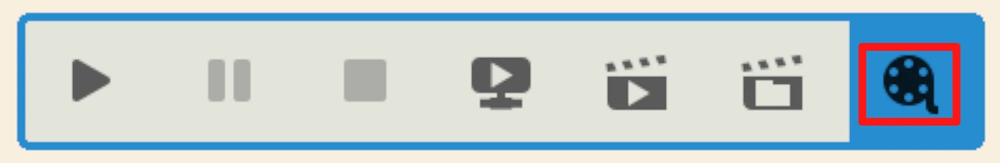
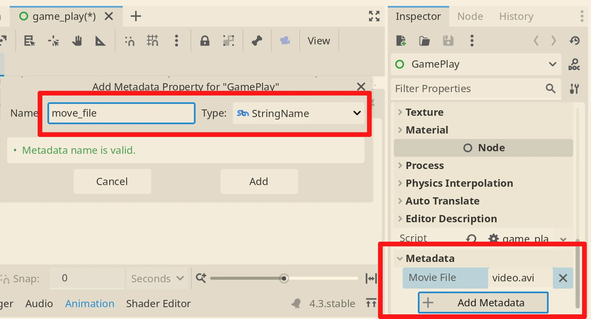
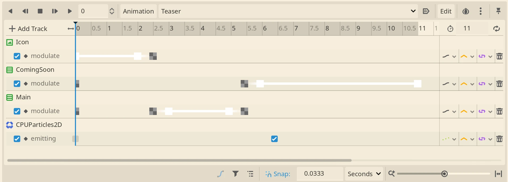

+++
title = "Having fun with Godot Movie Maker - Part 1"
description = "How I created a simple Steam trailer for my upcoming game 99 Managers Futsal Edition with Godot Movie Maker"
date = 2024-12-17T17:26:00+00:00
updated = 2024-12-17T17:26:00+00:00
draft = false
[extra]
mastodon_link = "https://mastodon.social/@dulvui/113669337023174194"
preview_image = "/blog/godot-moviemaker-part1/animation-player.webp"
+++

To release a game on Steam, it is good to have **at least one video trailer** about the game.
For releasing only the store page, it doesn't really need to be a video about actual game play.
It can only be a teaser, where you announce your game.  

I don't have much experience with video creation and editing, so I started to **search the web** once again for Open Source video editing tools.
The first I found where [OpenShot](https://www.openshot.org/), [Kdenlive](https://kdenlive.org) or directly [FFmpeg](https://www.ffmpeg.org/),
which I know from the past.
But I used them mostly to cut or modify existing videos, not to create new content from scratch.  

## Godot Movie Maker to the rescue!
After some time, I remembered that Godot actually has a feature called **Movie Maker**.
And the best part is:  
I know how to use Godot **+** it can make movies **= perfect match!**

Godot's Movie Maker feature allows you to create Movies with everything Godot is capable of.
So you can code a movie using **Tweens**, the **AnimationPlayer**, pure **code** or whatever comes to your mind.  
The best part is, everything is **automated** and supports versioning with **git**.
So for example it's possible to **translate** the video in different languages with ease.
Or if you made a mistake and broke something, simply run **git restore** and your work is save.



Here you can see the **magic button**, that transforms Godot into Hollywood.
Just press it and when you run a scene or the game, everything visible on the screen will be saved to a file.
The file needs to be defined under **Project Settings>Editor>Movie Writer>Movie File**.
Or add the String **move_file** to the scene's **metadata** as I did in the screenshot below.



If you plan to only make one video with your project, use the project settings.
Otherwise the metadata is more convenient, because you can have multiple files defined for different scenes.

## The first result
This is my very first video created with Godot. Oscars, I'm coming!  
You can find it on
[Steam](https://store.steampowered.com/app/3334770/99_Managers_Futsal_Edition/),
[YouTube](https://www.youtube.com/watch?v=ToVRZsfPimE)
or if you prefer, **more privacy friendly** on [Mastodon](https://mastodon.social/@dulvui/113628533674230281).

It's quite simple with no special effects, except the ball fireworks at the end.
But I was quite **fast** to create it and I was able to **iterate**, like I do with while programming.
I can only guess how much effort it would have been, to create it with some other video editing tool.

Below the few lines of code needed for this simple trailer.

```gd
extends Control

@onready var animation_player: AnimationPlayer = %AnimationPlayer


func _ready() -> void:
	theme = ThemeUtil.get_active_theme()
	animation_player.play("Teaser")
```
As you an see, the real work is done by the **AnimationPlayer**.
For someone who doesn't know Godot, the AnimationPlayer can **change the properties over time**.  
Like in the screenshot below, I can simply make text labels **fade in and out**,
or trigger the CPUParticles, that are the final ball fireworks effect.



For the first attempt this was totally fine, but it needs a **lot of clicking, sliding and patience**.
I highly prefer to code everything and use less the mouse.
But this will be covered in a future part 2 of this blog post.

You can find the full source code
on [Codeberg](https://codeberg.org/dulvui/99managers-futsal-edition/src/branch/main/game/src/media)
or [Github](https://github.com/dulvui/99managers-futsal-edition/tree/main/game/src/media).  
Note: The location of the trailer files might change in the future, so this links might break.
Let me know if that happens, so I can fix it.

## Performance
Video editing and gaming (in a world before LLMs) are the most resource intensive tasks you probably can do on a computer.
Godot isn't much different, but I have to say that **it worked quite well** on my potato laptop (dual core i5 7th gen, no GPU).
You can see the output directly while it is written to the file, and it **takes about 2x more** time.
So for a video of 10 seconds like mine, the recording takes about 20 seconds.
But I can imagine that a proper computer, should be able to play and write the videos **at normal speed**.

## What will be in part 2?
I actually wanted to fit also the second game play trailer in this blog post.
But I want to make it really good, to attract the most people possible with it.
For that reason, I still need some time to improve the game itself.  
But I can already anticipate that Godot's Movie Maker is **really powerful**.
I was able to use actual game scenes for the videos and even **interact** with them, while recording.

## Final thoughts
The Godot Movie Maker is much better as expected and makes the video making really fun.
It is incredible, how **simple but yet powerful** this feature is.  
I could imagine making videos also for non gaming stuff, where things like text or effects can be automated.  
Now I just need to add the Godot Engine to all the FOSS video creation tools list on the web ;-)
So the next one who searches the web, finds this hidden gem.  
Last but not least, the [official release note](https://godotengine.org/article/movie-maker-mode-arrives-in-godot-4/) of the Godot Movie Maker,
if you want to know more about it.


