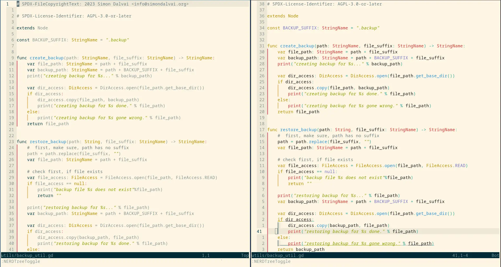
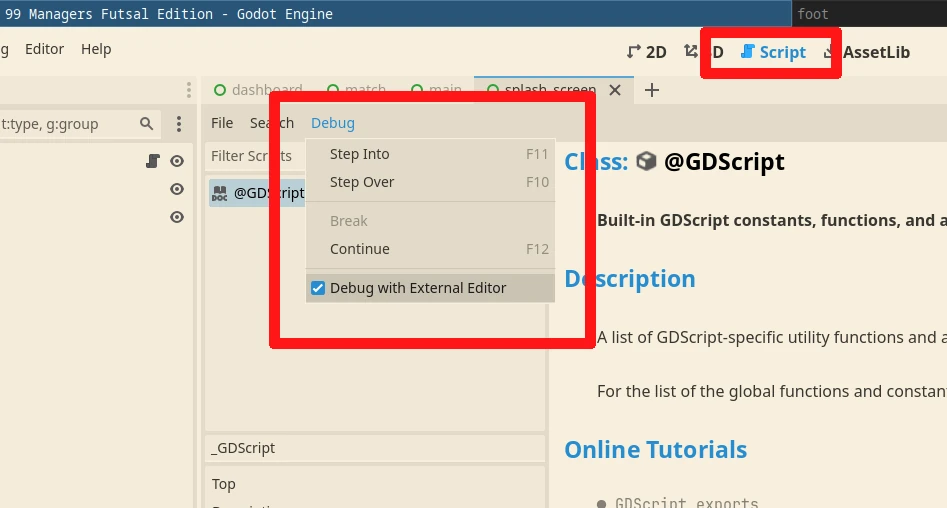

+++
title = "Neovim as External Editor for Godot"
descriptior = "How to setup and use Neovim as external Editor in Godot, with a few plugins."
date = 2025-01-17T22:00:00+00:00
updated = 2025-01-17T22:00:00+00:00
draft = false
[extra]
mastodon_link = ""
hackernews_link = ""
preview_image = "/blog/godot-neovim/godot-neovim.webp"
+++

Since some months now I'm happily using Neovim as an **external editor** with Godot Engine 3 and 4.
Godot's internal text editor is fine, but my desire to really learn Neovim was too big.  
There actually exists even an [Vim plugin](https://github.com/joshnajera/godot-vim) for Godot, that brings basic motions to the built-in text editor.
But I simply want to use the real thing.

This blog post covers a **minimal setup** to get Neovim working with Godot.
So you can integrate it directly to you existing configuration or extend it later.

Please note that some minimal knowledge about **Linux and Neovim config files** is needed to, be able follow this blog post.

Technically you can also **just use Godot with vanilla Neovim** with no further changes.
But then you might miss some features like **opening files** when clicked in the file explorer or **lsp support**.  
So lets set this up to let Godot add some magic to Neovim.

## Neovim server mode
Before we can set Neovim as external editor in Godot, we need to start Neovim in server mode. 
For that, a **pipe file** is needed, where Godot can send commands to Neovim.  
But first lets first create the nvim cache directory, where the file will be located.
```bash
mkdir -p ~/.cache/nvim
```

Now we can create the server pipe file in our **init.lua** file.
This will create the file and start Neovim in server mode, so it can handle calls from external tools, like Godot.
```lua
local pipepath = vim.fn.stdpath("cache") .. "/server.pipe"
if not vim.loop.fs_stat(pipepath) then
  vim.fn.serverstart(pipepath)
end
```

## Godot Editor Settings
Now you can set Neovim as external editor in **Editor Settings > Text Editor > External**.  
There you need to set the following values, as in the screenshot below.


1) Enable **Use External Editor**.  
2) Set **Exec Path** to the Neovim path.
3) Set **Exec Flags** to the following line.

Remember to replace **YOUR_USER** with your username.
```bash
--server /home/YOUR_USER/.cache/nvim/server.pipe --remote-send "<C-\><C-N>:e {file}<CR>:call cursor({line}+1,{col})<CR>"
```
The **+1** in `cursor({line}+1)` is to go to the correct line.
For some reason without +1, the line above is selected.

Now you can use Neovim as external editor in Godot and **open files** from the file explorer.
The next steps will extend it to add more features.

## LSP support
Godot has a built-in [**L**anguage **S**erver **P**rotocol](https://docs.godotengine.org/en/stable/tutorials/editor/external_editor.html#lsp-dap-support)
that gives you features like **code competition**, **error highlights** and **function definition lookups**.

First we need to install the [Neovim lsp plugin](https://github.com/neovim/nvim-lspconfig) and set it up.
I will use [vim-plug](https://github.com/junegunn/vim-plug) as my plugin manager.
```lua
-- Installation
Plug('neovim/nvim-lspconfig')

-- Setup
local lspconfig = require('lspconfig')
lspconfig.gdscript.setup{}
```
Now you can access all special features when opening GDScript files.  
You can try code competition with **Ctrl + x** and **Ctrl + o**.
This will suggest also all class names, function names etc in your Godot project.

I faced sometime some issues with the LSP, like not being able to look up functions or auto complete.
In this case you can try restarting the LSP plugin with the command `:LspRestart`, or simply restart Neovim.

Keep in mind that the LSP runs within Godot, so you need a running editor instance with your project open.

## Treesitter
To get colored code highlighting, [Treesitter](https://github.com/nvim-treesitter/nvim-treesitter) does a perfect job.
This plugin does also a lot of other things, like building a tree structure of your code.
Other plugins and Neovim might use that tree for better manipulation of your code.

But I (probably, I'm not sure) use it only for nicer colors.
```lua
-- Installation
Plug('nvim-treesitter/nvim-treesitter', { ['do'] = ':TSUpdate' })

-- Setup
require'nvim-treesitter.configs'.setup {
    ensure_installed = {'gdscript', 'godot_resource', 'gdshader'},
    highlight = {
        enable = true,
    },
    auto_install = false,
    -- disable for files bigger than 100 KB
    disable = function(lang, buf)
        local max_filesize = 100 * 1024 -- 100 KB
        local ok, stats = pcall(vim.loop.fs_stat, vim.api.nvim_buf_get_name(buf))
        if ok and stats and stats.size > max_filesize then
            return true
        end
    end,
}
```

Here you can see a side by side comparison of Treesitter **disabled on the left** and **enabled on the right**.



Neovim already can colorize some of the code, but Treesitter can do it better.


## Debugging
Godot has a built-in [**D**ebug**A**dapter**P**rotocol](https://docs.godotengine.org/en/stable/tutorials/editor/external_editor.html#lsp-dap-support),
so it is directly integrated with Godot, exactly as the LSP.
There are many Neovim Debug plugins out there, if you are already familiar with one, it's worth to check out if it support Godot.

While writing this blog post, I used to have [nvim-dap](https://github.com/mfussenegger/nvim-dap) installed.
This can attach to Godot's DAP and allows you to set breakpoints, run the game and debug it.
Then I also tried [nvim-dap-ui](https://github.com/rcarriga/nvim-dap-ui), that adds the needed UI with variable values etc. to Neovim.
But I faced several crashes of Godot and a inconsistent workflow.

To be honest, the Godot's debugger is hard to beat, with the remote tree inspector and all the rest.  
Secondly another huge problem for my game: **launching specific scenes**.  
I searched the web and haven't found a solution for this.
Since I really often run specific scenes, since my latest game got quite big.
Having to start from the main scene every time can get frustrating.  
But, you can run specific scenes from the editor, right?
Yes! But the problem is that then I can't set breakpoints.
Somehow Godot get's the breakpoints I set with nvim-dap, only when I start it from there.

So I had to ask myself: how the f*ck was I debugging the last months??  
And well, the ansewer is easy, I was not using nvim-dap, but the **breakpoint keyword**.
The following code will first print `Hello` and the break.
```gd
func _ready() -> void:
	print("Hello")
    breakpoint
	print("world!")
```
This can have the **disadvantages** that you need to write it, and remember **to remove it**.
No worries, it won't break your game when exported.
This keyword only works when the project runs inside Godot editor.  
But the **advantages** are that this breakpoints are in the code, so they are saved and can be **shared with others**.
And I don't need a Neovim plugin and can use the real power of it, **editing code**.

The best part of all this, I wrote my first self made Neovim custom functions/commands (or however they are called).
Seeing for the first time, why it is so cool and you can really make it you own.  
```lua
-- write breakpoint to new line
vim.api.nvim_create_user_command('GodotBreakpoint', function()
    vim.cmd('normal! obreakpoint' )
    vim.cmd('write' )
end, {})
vim.keymap.set('n', '<leader>b', ':GodotBreakpoint<CR>')

-- delete all breakpoints in current file
vim.api.nvim_create_user_command('GodotDeleteBreakpoints', function()
    vim.cmd('g/breakpoint/d')
end, {})
vim.keymap.set('n', '<leader>BD', ':GodotDeleteBreakpoints<CR>')

-- search all breakpoints in project
vim.api.nvim_create_user_command('GodotFindBreakpoints', function()
    vim.cmd(':grep breakpoint | copen')
end, {})
vim.keymap.set('n', '<leader>BF', ':GodotFindBreakpoints<CR>')
```

So I created the custom command **GodotBreakpoint**.
It simply adds the String breakpoint below the line the cursor is on, indented correctly
(that might be caused by other some plugin/config).  
The second command is**GodotDeleteBreakpoints**, that deletes all breakpoints lines in the current buffer.  
And the last command **GodotFindBreakpoints** finds all breakpoints in the 

Finally you need to enable also **Debug with External Editor** under the Script view.



## Godot documentation
You can read documentation for a function with **Shift + k**, while the Neovim cursor is on a function in normal mode.
If you want to read or search **Godot's full offline** documentation, you can still do that in the Editor with the **Search Help** button.
This will open the documentation in Godot's built-in text Editor.  
I don't know if it's even possible to open also this files in Neovim, but for me this is totally fine.

## Full Neovim configuration
Here you can find the **full init.lua** file, ready to be hacked and extended.  
You can find my full Neovim configuration in my dofiles repo on [Codeberg](https://codeberg.org/dulvui/dotfiles) and [Github](https://github.com/dulvui/dotfiles).
This contains some more plugins, colorschemes and configurations.
```lua
-- ----------------------
-- vim-plug plugin-manager
-- ----------------------
local vim = vim
local Plug = vim.fn['plug#']
vim.call('plug#begin')
Plug('nvim-treesitter/nvim-treesitter', { ['do'] = ':TSUpdate' })
Plug('neovim/nvim-lspconfig')
vim.call('plug#end')

-- ----------------------
-- Start as server
-- ----------------------
local pipepath = vim.fn.stdpath("cache") .. "/server.pipe"
if not vim.loop.fs_stat(pipepath) then
  vim.fn.serverstart(pipepath)
end

-- ----------------------
-- lsp
-- ----------------------
local lspconfig = require('lspconfig')
lspconfig.gdscript.setup{}

-- ----------------------
-- treesitter
-- -- ----------------------
require'nvim-treesitter.configs'.setup {
    ensure_installed = {'gdscript', 'godot_resource', 'gdshader'},
    highlight = {
        enable = true,
    },
    auto_install = false,
    disable = function(lang, buf)
        local max_filesize = 100 * 1024 -- 100 KB
        local ok, stats = pcall(vim.loop.fs_stat, vim.api.nvim_buf_get_name(buf))
        if ok and stats and stats.size > max_filesize then
            return true
        end
    end,
}

-- ----------------------
-- Godot debug config
-- ----------------------
-- write breakpoint to new line
vim.api.nvim_create_user_command('GodotBreakpoint', function()
    vim.cmd('normal! obreakpoint' )
    vim.cmd('write' )
end, {})
vim.keymap.set('n', '<leader>b', ':GodotBreakpoint<CR>')

-- delete all breakpoints in current file
vim.api.nvim_create_user_command('GodotDeleteBreakpoints', function()
    vim.cmd('g/breakpoint/d')
end, {})
vim.keymap.set('n', '<leader>BD', ':GodotDeleteBreakpoints<CR>')

-- search all breakpoints in project
vim.api.nvim_create_user_command('GodotFindBreakpoints', function()
    vim.cmd(':grep breakpoint | copen')
end, {})
vim.keymap.set('n', '<leader>BF', ':GodotFindBreakpoints<CR>')
```

## What I miss in Neovim
So far the biggest feature I miss, is the easy drag and drop of a Node into the text editor.
This will automatically create the var with the correct Nodepath.
But after some time I found a much better approach by using **%** and 
[**Access as Unique Name**](https://docs.godotengine.org/en/stable/tutorials/scripting/scene_unique_nodes.html#creation-and-usage).
With this you can access the Node without having to write the full Node path.
```gd
# This long path
@onready var healt_label: Label = $MarginContainer/HBoxContainer/VBoxContainer/HealthLabel
# simply becomes
@onready var healt_label: Label = %HealthLabel
```
Another crucial advantage is that you can move the Node around the tree, or change parent Nodes, without having to adjust the path.

At the end of the day, being able to use Neovim pays back anyways, if you like it and are keen to learn new stuff.  
Or you already know everything about Vim/Neovim, but let's be honest, **nobody does**.
