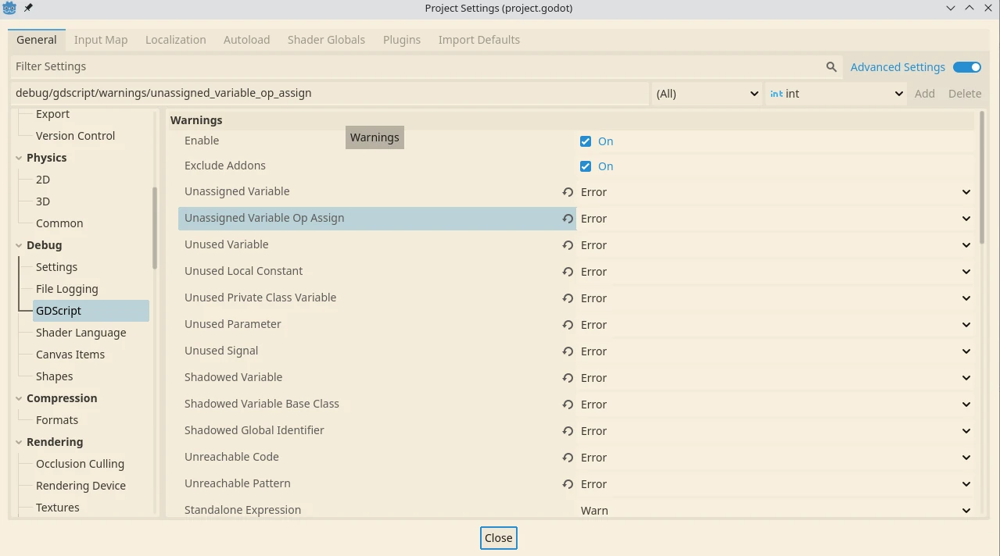

+++
title = "Godot static types, a hidden gem"
description = "How to use static types in Godot Engine, to prevent bugs, even before starting the game."
date = 2024-05-29T21:20:00+00:00
dupdated = 2024-05-29T21:20:00+00:00
[extra]
mastodon_link = "https://mastodon.social/@dulvui/112526439081963874"
hackernews_link = "https://news.ycombinator.com/item?id=40517052"
+++

GDScript is a dynamic typed language, but you can add type hints, that make it a Static Typed language.
This increases **performance** and helps to **avoid bugs.**  

So let's see how to use Static Types and get the most out of them.

## Hello Godot's typing system
Variables can be defined in the following ways
```gd
# dynamic
var a = "hello"
# automatic type guess
var b := "hello"
# static typing
var c: String = "hello" 
```

It is highly recommended to use one typing system across your project.  
I suggest to **always use static typing**, even for small projects.
This can help to **prevent errors** before even the game runs.  
With dynamic typing, you could have a bug in your code, and only see it while playing.
Your game might run fine, until the specific code with the error gets executed. 

It is also a wise choice, to use Static Typing from the very **beginning of the project**.
Making a project Static Typed afterwards, can be quite time consuming and frustrating.  
Trust me, I've been there already...

## Project settings to have stricter error checks
First you have to enable Advanced settings in the Project Settings.
Then under **Debug** -> **GDScript** you can change how the editor handles different warnings as errors and vice versa.
Changing here some warnings to errors can be game changing and really important to bring real static typing advantages.

Here the setup I'm currently using: 
  

In Editor Settings, you can also enable **Add Type Hints** under Text Editor -> Completition -> Add Type Hints, to get automated type hints by the editor.
So for example, when you let Godot auto complete a function, the editor adds the type hints.

Another good habit is to use **class_name** in your custom Nodes as much as possible.
With static typing and class_name you can get auto complete for functions and variables.

**Tip:** to add a Node from the Node tree directly into the script, simply click the node with the mouse, press Ctrl and drag it into the script.
This works also with multiple selected Nodes.

## Code examples
First, lets create a simple static class script.
```gd
class_name StaticClass
extends Node

var alice: String
```

### Wrong type & Dynamic Static Type
In another file, let's try to assign a **wrong type** to `alice`, that is a actually a String
```gd
extends Node2D

func _ready() -> void:
    var static_class = StaticClass.new()
    static_class.alice = 10
```

We will get the following error message, **after** starting the Scene.
```gd
Error: Invalid set index 'alice' (on base: 'Node (StaticClass)') with value of type 'int'.
```

### Wrong type & Static Type
Let's try to assign a **wrong type** to `alice`, but with Static Typing for `static_class`
```gd
extends Node2D

func _ready() -> void:
    var static_class:StaticClass = StaticClass.new()
    static_class.alice = 10
```

We will see the following error message, **before** starting the Scene.
```gd
Cannot assign a value of type "int" as "String".

```

### Nonexistent variable & Dynamic Type
Now, let's try to access a **nonexistent variable**
```gd
extends Node2D

func _ready() -> void:
    var static_class = StaticClass.new()
    static_class.bob = 10
```

We will get the following error message, **after** starting the Scene as a error message in the editor.
```gd
Error: Invalid set index 'bob' (on base: 'Node (StaticClass)') with value of type 'int'.
```

So same error as before, but actually a different problem.

### Nonexistent variable & Static Type & Inferred Declaration
If **Inferred Declaration** is enabled as error in project settings, you get an error directly in the editor, **before** starting the Scene.  
```gd
extends Node2D

func _ready() -> void:
    var static_class: StaticClass = StaticClass.new()
    static_class.bob = 10
```
Note: You might need to restart the editor, to see the effects. 

Here the error message.
```gd
The property "bob" is not present on the inferred type "StaticClass" (but may be present on a subtype). (Warning treated as error.)
```

So using Static Typing and having some Debug Settings changed to error, we can see errors, before running the game.

## Further reading
The best place to read in general about Godot are the official docs, since they will be up to date and explain everything.  
Here the official docs about [Static Typing](https://docs.godotengine.org/en/stable/tutorials/scripting/gdscript/static_typing.html)

I tried some performance benchmarks with static typed and dynamic typed code, but haven't found any significant difference.
Probably I simply did the wrong operations, where this performance gain is not really visible.  
If you have some example, please let me know, so I can extend this article.
